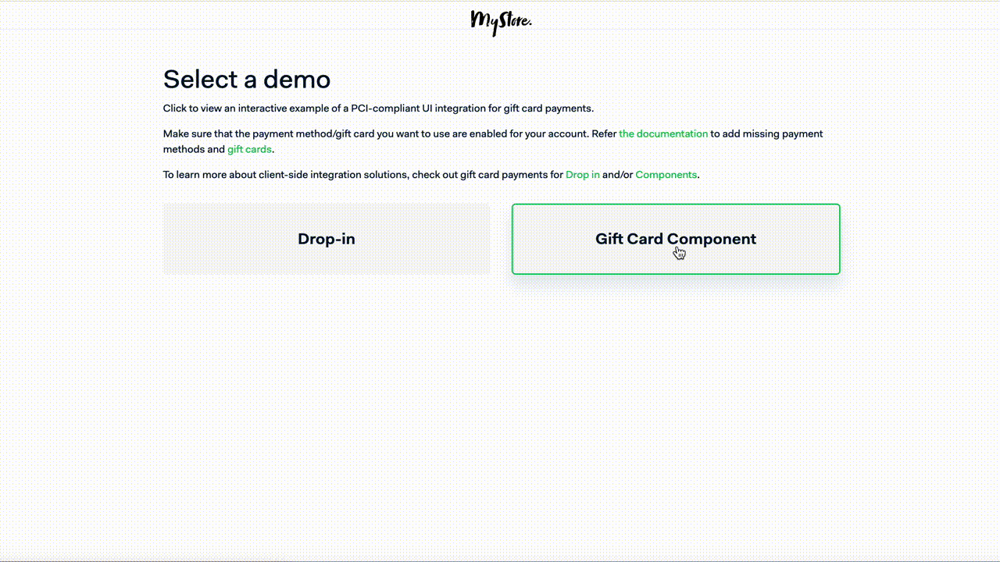
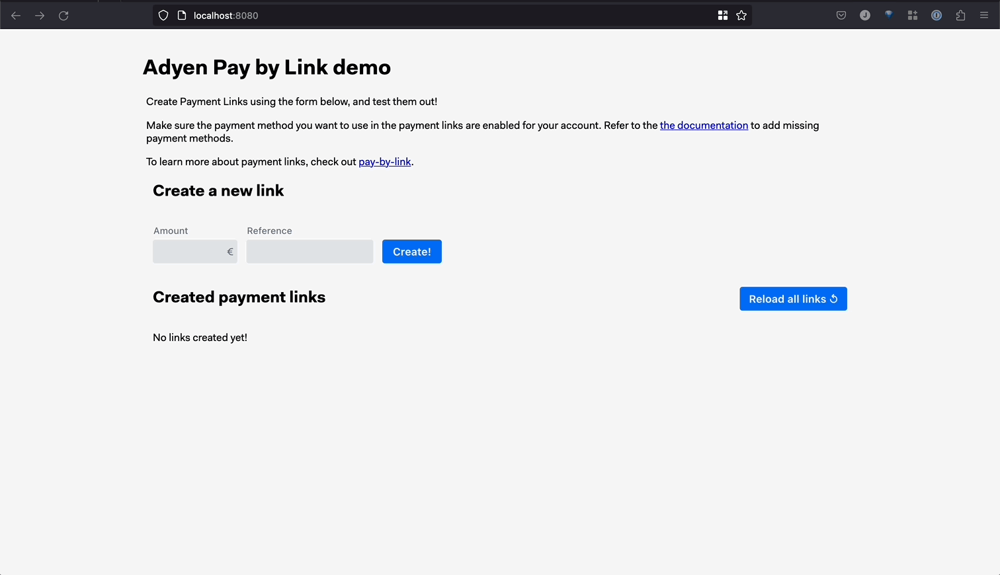

# Adyen Online Payment Integration Demos

 

This repository includes a collection of PCI-compliant UI integrations that show how to integrate with Adyen using different payment methods. 
The demos below leverages Adyen's API Library for Java using Spring ([GitHub](https://github.com/Adyen/adyen-java-api-library) | [Documentation](https://docs.adyen.com/development-resources/libraries?tab=java_2)).

Get started by navigating to one of the supported demos below.

|                                          Demos | Description                                              | Details                            |
|-----------------------------------------------:|:---------------------------------------------------------|:-----------------------------------|
|         [`Checkout Example`](checkout-example) | E-commerce checkout flow with different payment methods. | [See below](#checkout-example)     | 
|        [`Gift Card Example`](giftcard-example) | Gift Cards checkout flow using partial orders.           | [See below](#gift-card-example)    | 
|     [`Pay By Link Example`](paybylink-example) | Create payment links in seconds.                         | [See below](#paybylink-example)    | 
| [`Subscription Example`](subscription-example) | Subscription flow using Adyen tokenization.              | [See below](#subscription-example) | 

## [Checkout Example](checkout-example)

The [checkout example](checkout-example) repository includes examples of PCI-compliant UI integrations for online payments with Adyen.
Within this demo app, you'll find a simplified version of an e-commerce website, complete with commented code to highlight key features and concepts of Adyen's API.
Check out the underlying code to see how you can integrate Adyen to give your shoppers the option to pay with their preferred payment methods, all in a seamless checkout experience.

## [Gift Card Example](giftcard-example)

The [gift card example](giftcard-example) repository includes a gift card flow during checkout. Within this demo app, you'll find a simplified version of an e-commerce website. 
The shopper can choose to use gift cards to complete their purchase or use their preferred payment method to pay the remaining amount.

## [PayByLink Example](paybylink-example)

The [paybylink example](paybylink-example) repository includes a simple example interface to manage pay by links payment. Within this demo app, you can create payment links, and see their status updated in real-time.
If you want to know more about Pay by link, check out our related [blog post](https://www.adyen.com/blog/pay-by-link-for-developers) or the [documentation](https://docs.adyen.com/checkout/pay-by-link).

## [Subscription Example](subscription-example)

The [subscription example](subscription-example) repository includes a tokenization example for subscriptions. Within this demo app, you'll find a simplified version of a website that offers a music subscription service.
The shopper can purchase a subscription and administrators can manage the saved (tokenized) payment methods on a separate admin panel.
The panel allows admins to make payments on behalf of the shopper using this token.

## Contributing

We commit all our new features directly into our GitHub repository. Feel free to request or suggest new features or code changes yourself as well!

Find out more in our [contributing](https://github.com/adyen-examples/.github/blob/main/CONTRIBUTING.md) guidelines.

## License

MIT license. For more information, see the **LICENSE** file.
