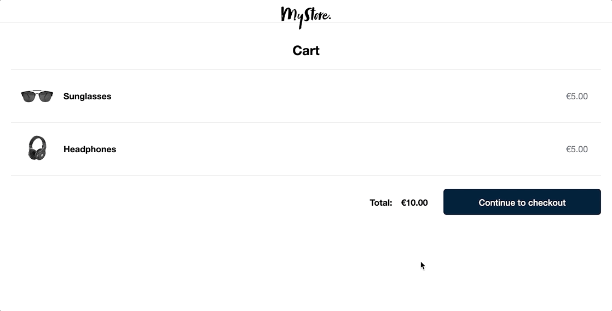

# Adyen [Online Payments](https://docs.adyen.com/online-payments) Integration Demo - Sessions Flow

## Run demo in one-click

[](https://gitpod.io/#https://github.com/adyen-examples/adyen-java-spring-online-payments/tree/main/checkout-example-advanced)  
&nbsp;[**Click here if it's your first time with Gitpod**](https://github.com/adyen-examples/.github/blob/main/pages/gitpod-get-started.md)

## Description
This repository includes examples of PCI-compliant UI integrations for online payments with Adyen.
Within this demo app, you'll find a simplified version of an e-commerce website, complete with commented code to highlight key features and concepts of Adyen's API.
Check out the underlying code to see how you can integrate Adyen to give your shoppers the option to pay with their preferred payment methods, all in a seamless checkout experience.

> **Note:**
For a simpler flow using `/sessions`, check out the demo in the [`checkout-example`](../checkout-example) folder.





## Requirements

- [Adyen API Credentials](https://docs.adyen.com/development-resources/api-credentials/)
- Java 17
- Network access to maven central

## 1. Installation

```
git clone https://github.com/adyen-examples/adyen-java-spring-online-payments.git
```

## 2. Set the environment variables
* [API key](https://docs.adyen.com/user-management/how-to-get-the-api-key)
* [Client Key](https://docs.adyen.com/user-management/client-side-authentication)
* [Merchant Account](https://docs.adyen.com/account/account-structure)
* [HMAC Key](https://docs.adyen.com/development-resources/webhooks/verify-hmac-signatures)

On Linux/Mac/Windows export/set the environmental variables.
```shell
export ADYEN_API_KEY=yourAdyenApiKey
export ADYEN_MERCHANT_ACCOUNT=yourAdyenMerchantAccount
export ADYEN_CLIENT_KEY=yourAdyenClientKey
export ADYEN_HMAC_KEY=yourHmacKey
```

Alternatively, it's possible to define the variables in the `application.properties`.
```txt
ADYEN_API_KEY=yourAdyenApiKey
ADYEN_MERCHANT_ACCOUNT=yourAdyenMerchantAccount
ADYEN_CLIENT_KEY=yourAdyenClientKey
ADYEN_HMAC_KEY=yourHmacKey
```

## 3. Configure allowed origins (CORS)

It is required to specify the domain or URL of the web applications that will make requests to Adyen.

In the Customer Area add `http://localhost:8080` in the list of Allowed Origins associated with the [Client Key](https://docs.adyen.com/user-management/client-side-authentication).

## 4. Run the application

```
cd checkout-example
    
./gradlew bootRun
```

Visit [http://localhost:8080/](http://localhost:8080/) to choose an integration type.

Try out the different payment methods with our [test card numbers](https://docs.adyen.com/development-resources/test-cards/test-card-numbers) and other payment method details.

# Webhooks

Webhooks deliver asynchronous notifications obout the payment status and other events that are important to receive and process.
You can find more information about webhooks in [this blog post](https://www.adyen.com/knowledge-hub/consuming-webhooks).

### Webhook setup

In the Customer Area under the `Developers → Webhooks` section, [create](https://docs.adyen.com/development-resources/webhooks/#set-up-webhooks-in-your-customer-area) a new `Standard webhook`.

A good practice is to set up basic authentication, copy the generated HMAC Key and set it as an environment variable. The application will use this to verify the [HMAC signatures](https://docs.adyen.com/development-resources/webhooks/verify-hmac-signatures/).

Make sure the webhook is **enabled**, so it can receive notifications.

### Expose an endpoint

This demo provides a simple webhook implementation exposed at `/api/webhooks/notifications` that shows you how to receive, validate and consume the webhook payload.

### Test your webhook

The following webhooks `events` should be enabled:
* **AUTHORISATION**


To make sure that the Adyen platform can reach your application, we have written a [Webhooks Testing Guide](https://github.com/adyen-examples/.github/blob/main/pages/webhooks-testing.md)
that explores several options on how you can easily achieve this (e.g. running on localhost or cloud).

## Contributing
Are we missing features? Did you find a bug? Let us know!
Find out more in our [contributing guidelines](https://github.com/adyen-examples/.github/blob/main/CONTRIBUTING.md).
